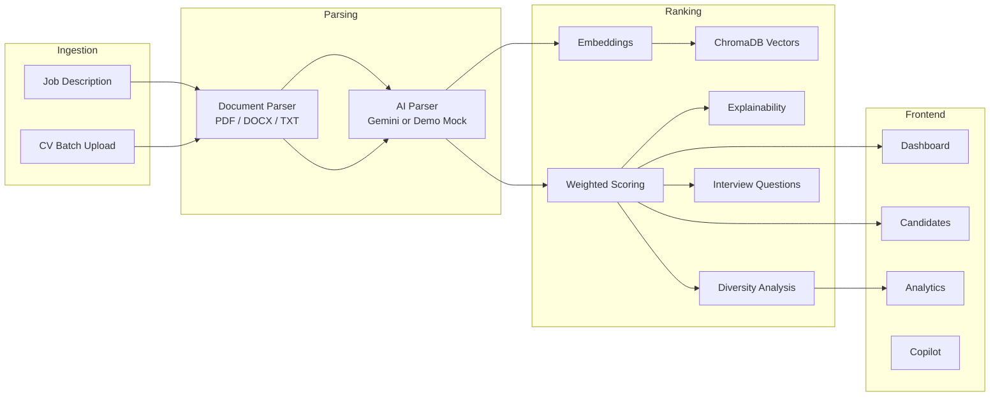

# Assignment 5: AI-Augmented Recruitment Platform

**Screen 1,000 CVs. Surface the 10 who matter. Explain why.**

| Assignment | Category | Group Size | Marks |
|------------|----------|------------|-------|
| #5 of 15 | HR AI | 5 Students | 15 + 3 Bonus |

---

## Problem Statement

Recruiters are drowning in volume. ATS keyword matching is brittle — it rejects great candidates and passes keyword-stuffed CVs. This platform goes **beyond keyword matching** to semantic understanding of fit, and explains ranking decisions transparently.

---

## What We Built

A recruitment augmentation platform with:

- JD ingestion and structured parsing
- CV batch upload (PDF, DOCX, TXT)
- AI semantic ranking with score breakdown
- Explainable rankings per candidate
- Bias & diversity flagging
- Tailored interview question generation

**Product name:** RecruitIQ AI

---

## Core Features → Implementation Map

Each assignment requirement maps to a concrete module in the codebase.

| Core Feature | What It Does | Backend | Frontend |
|--------------|--------------|---------|----------|
| **Job Description Parser** | Extracts hard/soft skills, experience level, domain knowledge, must-have vs nice-to-have from any JD format | `ai_service.parse_job_description()` + `document_parser.py` → `POST /upload-jd` | Dashboard: upload/paste JD + **Parsed Job Requirements** panel |
| **CV Ingestion & Parsing** | Batch upload PDF/DOCX/TXT; extract experience, skills, education, tenure, career trajectory | Background task in `api.py` → `save_parsed_candidate()` | Dashboard: multi-file upload with progress polling |
| **Semantic Candidate Scoring** | Score candidates semantically (not keyword-only); rank with category breakdown | `ranking_service.rank_candidates()` + `ai_service.compute_scores()` → weighted formula | Candidates table, radar charts on profile |
| **Explainable Rankings** | Per-candidate justification: fit, gaps, risks, interview focus | `ai_service.generate_explanation()` stored in `CandidateScore` | Candidate profile: executive summary + 4-quadrant explanation |
| **Bias & Diversity Flags** | Flag homogeneous shortlists; surface high-scoring non-traditional candidates | `diversity_service.analyze_diversity()` + `identify_hidden_gems()` | Dashboard + Analytics: **Bias & Diversity Flags** panel |
| **Interview Question Generator** | Tailored questions probing background, skills, and gaps | `generate_questions_for_candidate()` → `POST /generate-questions` | Candidate profile; **auto-generated for top 10** after ranking |

### Scoring Formula (Semantic, Not Keyword-Only)

```
Overall Score =
  40% Skill Match      (semantic overlap on parsed skill lists)
+ 25% Experience Match (years + tenure trajectory heuristics)
+ 15% Domain Match     (vector embedding cosine similarity)
+ 10% Education Match  (parsed education vs JD requirements)
+ 10% Soft Skill Match (parsed soft skills vs JD)
```

Embeddings use Google `gemini-embedding-001` (or deterministic mock embeddings in demo mode). Domain scoring uses **vector similarity** — not raw keyword counts.

---

## Architecture



---

## Success Metrics → How We Meet Them

| Metric | Target | Our Approach |
|--------|--------|--------------|
| **Ranking accuracy** | Strongest candidates surface over weaker ones | Weighted multi-factor scoring on 25 curated sample CVs against a Senior Backend Engineer JD; seed script validates rank order |
| **Explanation quality** | Specific per candidate, not boilerplate | LLM JSON output (or CV/JD-aware mock) with strengths, gaps, risks, potential tied to parsed profile |
| **Interview questions** | Tailored to each CV | Questions reference candidate companies, projects, and identified gaps; auto-generated for top 10 shortlist |
| **Performance** | 20+ CVs in under 60 seconds | Async background processing with progress polling; demo mode completes ~25 CVs in seconds |
| **Bias flag** | Triggers on skewed shortlist | Educational/employer concentration thresholds (e.g. 60%+ from 2 universities) + hidden gem detection |

---

## Quick Start (Docker)

```bash
cp .env.example .env
docker compose up --build
```

| Service | URL |
|---------|-----|
| Frontend | http://localhost:3000 |
| Backend API | http://localhost:8000 |
| Swagger Docs | http://localhost:8000/docs |
| Health Check | http://localhost:8000/health |

**Demo mode** is enabled by default (`DEMO_MODE=true`). No Gemini API key required — intelligent mock AI handles parsing, scoring, explanations, and questions for offline demos.

---

## Demo Workflow (Step by Step)

1. Open http://localhost:3000 → **Launch Dashboard**
2. **Upload JD** — paste text or upload `sample-data/job_descriptions/senior_backend_engineer.txt`
3. Review the **Parsed Job Requirements** panel (skills, must-have, nice-to-have)
4. **Upload CVs** — select all files from `sample-data/cvs/` (25 `.txt` resumes)
5. Wait for processing (progress bar via `/processing/{job_id}`)
6. Click **Rank Candidates**
7. Explore results:
   - **Top Ranked Candidates** table on Dashboard
   - **Bias & Diversity Flags** — concentration alerts + hidden gems
   - **Candidates** page — filter by min score, hidden gems
   - **Analytics** — score distribution, skill heatmap, funnel
   - **Compare** — side-by-side 2–4 candidates
   - **Copilot** — chat over candidate pool
8. Open a candidate profile → radar chart, explanation, **auto-generated interview questions**
9. Download CSV/PDF exports

### One-Command Seed (Skip Manual Upload)

```bash
python3 scripts/seed_data.py
```

Loads the sample JD, parses all 25 CVs, runs ranking, diversity analysis, and question generation.

---

## Local Development

### Prerequisites

- Node.js 20+
- Python 3.12+
- (Optional) Gemini API key for live AI

> No database to install — the backend keeps all state in memory (it resets on restart).

### Backend

```bash
cd backend
python3 -m venv .venv
source .venv/bin/activate
pip install -r requirements.txt
cp ../.env.example ../.env   # optional: add GEMINI_API_KEY
uvicorn app.main:app --reload --port 8000
```

### Frontend

```bash
cd frontend
npm install
npm run dev
```

---

## Environment Variables

| Variable | Default | Description |
|----------|---------|-------------|
| `GEMINI_API_KEY` | _(empty)_ | Google Gemini key; leave empty for demo mode |
| `DEMO_MODE` | `true` | Use mock AI when no API key |
| `CORS_ORIGINS` | `http://localhost:3000` | Allowed frontend origins |
| `CORS_ORIGIN_REGEX` | _(empty)_ | Regex for extra origins, e.g. `https://.*\.vercel\.app` |
| `NEXT_PUBLIC_API_URL` | `http://localhost:8000` | Backend URL for frontend |
| `CHROMA_PERSIST_DIR` | `./chroma_data` | ChromaDB storage path |
| `MAX_UPLOAD_SIZE_MB` | `10` | Per-file upload limit (enforced) |
| `RATE_LIMIT_PER_MINUTE` | `60` | API rate limit |

---

## Project Structure

```
AI_Recruitment_Platform/
├── backend/
│   ├── app/
│   │   ├── main.py                 # FastAPI entry
│   │   ├── routers/api.py          # REST endpoints
│   │   ├── models/entities.py      # SQLAlchemy models
│   │   ├── schemas/                # Pydantic models
│   │   └── services/
│   │       ├── ai_service.py       # Gemini + mock AI
│   │       ├── document_parser.py  # PDF/DOCX/TXT extraction
│   │       ├── ranking_service.py  # Ranking pipeline
│   │       ├── diversity_service.py# Bias/diversity flags
│   │       ├── analytics_service.py# Dashboard analytics
│   │       ├── report_service.py   # PDF reports
│   │       └── vector_store.py     # ChromaDB
│   └── tests/
├── frontend/
│   ├── src/app/                    # Next.js 15 pages
│   │   ├── dashboard/              # JD upload, CV batch, rank
│   │   ├── candidates/             # Searchable candidate table
│   │   ├── analytics/              # Charts + diversity flags
│   │   ├── compare/                # Side-by-side comparison
│   │   └── copilot/                # Recruiter chat
│   └── src/components/
│       └── dashboard/
│           ├── diversity-alerts.tsx
│           └── parsed-jd-preview.tsx
├── sample-data/
│   ├── cvs/                        # 25 sample resumes
│   └── job_descriptions/           # Sample JDs
├── scripts/seed_data.py
├── docs/API.md
└── docker-compose.yml
```

---

## API Reference

| Method | Endpoint | Description |
|--------|----------|-------------|
| `POST` | `/api/v1/upload-jd` | Upload or paste job description |
| `POST` | `/api/v1/upload-cvs` | Batch upload CVs (async) |
| `GET` | `/api/v1/processing/{job_id}` | Poll processing status |
| `POST` | `/api/v1/rank-candidates` | Rank all candidates for a JD |
| `GET` | `/api/v1/candidates` | List, search, filter, paginate |
| `GET` | `/api/v1/candidate/{id}` | Full profile + scores + questions |
| `GET` | `/api/v1/analytics` | Dashboard analytics + diversity alerts |
| `POST` | `/api/v1/generate-questions` | Generate interview questions |
| `POST` | `/api/v1/generate-report` | Download candidate PDF |
| `GET` | `/api/v1/export/csv` | Export ranked candidates CSV |
| `GET` | `/api/v1/export/pdf` | Export pool PDF report |
| `POST` | `/api/v1/chat` | Recruiter copilot |
| `POST` | `/api/v1/compare` | Compare 2–4 candidates |
| `POST` | `/api/v1/hiring-recommendation` | Top-3 + hidden gems |

Full docs: [docs/API.md](docs/API.md) and http://localhost:8000/docs

---

## Diversity & Ethics

- **No protected-attribute inference** — we do not infer gender, ethnicity, religion, or caste
- Flags are based on **structural signals**: university concentration, employer concentration, career path similarity
- **Hidden gems**: candidates scoring >80% with non-traditional educational or employer backgrounds
- Alerts surface on Dashboard and Analytics after ranking

---

## Testing

```bash
cd backend
pip install -r requirements.txt

# Full suite (no external services needed — uses an in-memory DB)
python3 -m pytest tests/ -v
```

---

## Tech Stack

| Layer | Technology |
|-------|------------|
| Backend | Python 3.12, FastAPI, Uvicorn |
| Frontend | Next.js 15, React 19, TypeScript, Tailwind CSS 4 |
| Storage | In-memory (SQLAlchemy 2 + SQLite, no persistence) |
| Vector Store | ChromaDB |
| AI | Google Gemini `gemini-2.0-flash` + `gemini-embedding-001` |
| Documents | PyMuPDF, pdfplumber, python-docx |
| Reports | ReportLab (PDF) |
| DevOps | Docker Compose |

---

## Performance Targets

| Batch Size | Target | Mechanism |
|------------|--------|-----------|
| 20 CVs | < 60 seconds | Async background tasks + demo-mode mocks |
| 100 CVs | < 5 minutes | Same pipeline; live Gemini adds latency |

Progress is polled via `GET /processing/{job_id}`.

---

## License

Built for university evaluation and demonstration purposes.
# GenAI_Group35_Assingment5
